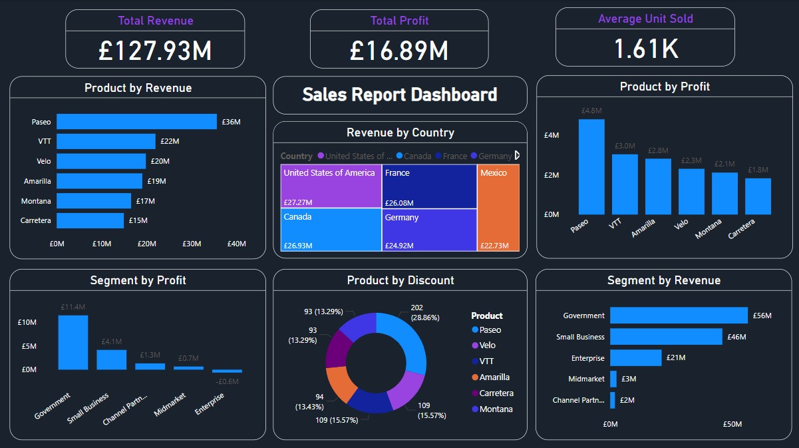
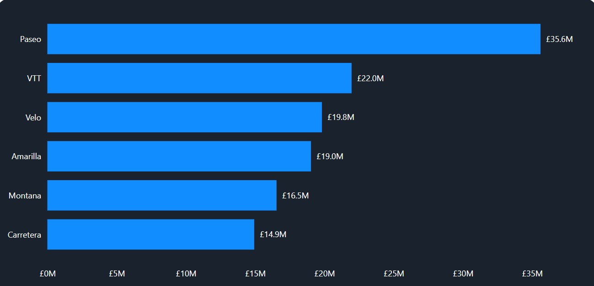
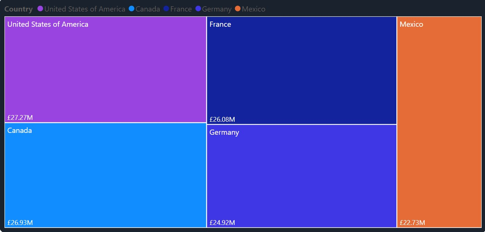
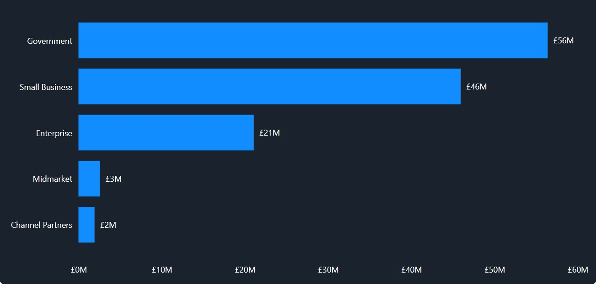
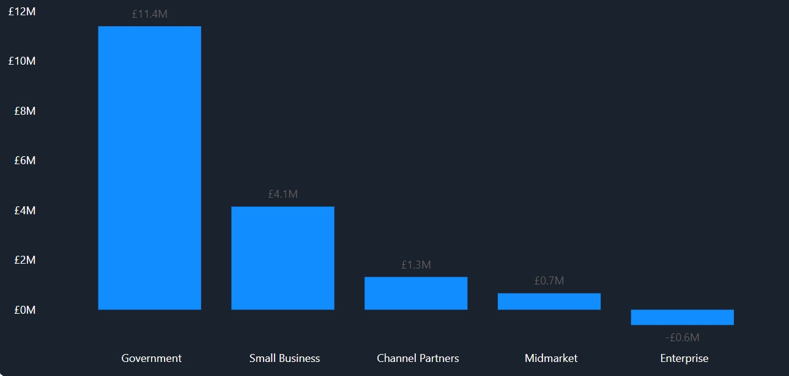
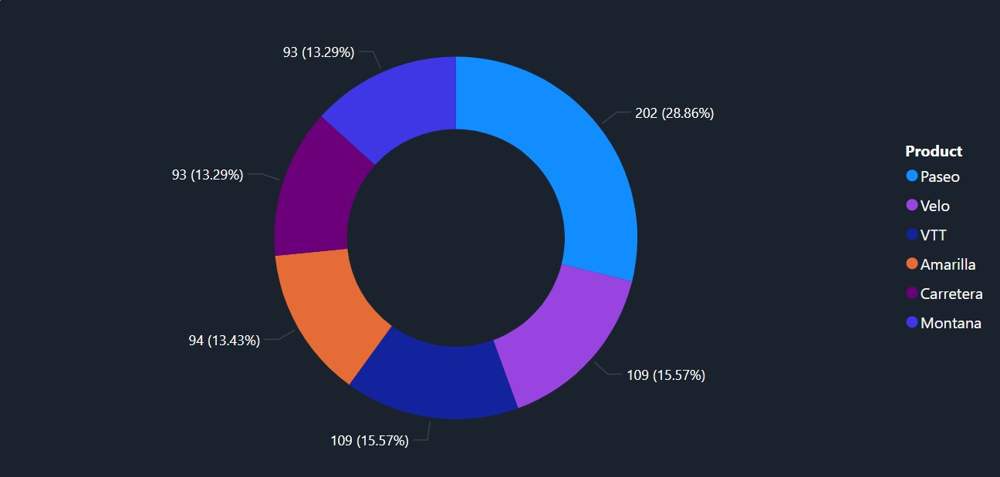

### XYZ Company Sales Analysis Report

---
## Introduction
I was assigned the task of bringing out insight from the insight from this data which has helped me practice my data cleaning, analysis, and visualisation skills.

**_Disclaimer_** : _All datasets and reports do not represent any company, institution or country, but just a dataset to demonstrate capabilities of Power BI._

## Problem Statement
1. What is the worth in £ of the total sales and profit?
2. Which product has the highest revenue in the current year?
3. What is the worth in £ of the total revenue by country and segment?
4. How does the discount by product look like?

## Power BI Concepts/Skills Applied:
The following Power BI features were incorporated:
- DAX; Calculated Columns, Measure calculation, Custom Columns 
- Filters
- Visualisation

## Data Sourcing
After assessing the questions above, I went ahead to extract the data from its source in CSV file into Power BI for cleaning, analysis, and visualisation.

It contains a table with 700 rows and 14 columns

## Data Transformation/Cleaning

Data was efficiently cleaned using the Power Query Editor of Power BI. (A screenshot of the applied steps). Some of the applied steps included: 

- Making the first row as headers in the table
- Analytic transformation of the table; to create measures and new columns such as Average Unit Sold = AVERAGE(FinData[Units Sold]), Revenue = FinData[Units Sold] * FinData[Sales Price], Average Profit = Average(FinData[Profit])
- Data type changed from 'TEXT' to 'WHOLE NUMBER', 'WHOLE NUMBER' to 'CURRENCY'
- Deleting irrelevant columns

## Data Analysis & Visuals

1. From the dashboard it can be observed that the total revenue (total sales) made in the current year is £127.93M 
2. The profit made was about £16.89M from average unit sold of about 1600 products.

3. At £35M, Paseo most valuable customer and was 138.40% higher than Carretera, which had the lowest Revenue at £16. Paseo accounted for 27.84% of Sum of Revenue.

Country by Revenue         |     Sector by Revenue
:-------------------------:|:---------------------------:
  |   
4. Across all 5 Countries the highest revenue came from United State of America with about £27.27M followed by France with Mexica below the chat with about £22.7M 5. Also across all 5 Segment, revenue ranged from £2M to £11M with the most revenue emanating from the Government

5. Across all 5 Segment, Profit ranged from -£614,545.625 to £11,388,173.17.

6. The highest discounted product was Paseo with about 28.9% of the total discount followed by Velo and VTT, while Carretera was the least discounted product.

## Conclusion
The dashboard reveals several critical insights into the sales performance and profitability of the organization over the current year.

1. Total revenue for the year was £127.93 million, with a profit of £16.89 million from approximately 1,600 units sold. 😄
2. Paseo was the top product, generating £35 million (27.84% of total revenue)😄, significantly higher than Carretera's £16 million.
3. The United States led revenue by country at £27.27 million, followed by France and Mexico.
4. The government sector generated the most revenue among segments, ranging from £2 million to £11 million.
5. Profit varied widely across segments, from a loss of £614,546 to a profit of £11,388,173.
6. Paseo received the highest discount (28.9%), followed by Velo and VTT, with Carretera receiving the least discount.

## Recommendations

1. Strengthen Customer Relationships: Focus on retaining and growing high-value products like Paseo through personalized offers and loyalty programs.
2. Expand in High-Revenue Regions: Increase market share in the US and France with targeted marketing and strategic partnerships.
3. Improve sector Profitability: Analyze and address factors causing losses in certain segments, optimize costs, and enhance marketing strategies.
4. Optimize Discount Strategies: Re-evaluate discount effectiveness to ensure they boost sales without eroding profits.
5. Enhance Operational Efficiency: Streamline processes and reduce costs in lower-profit areas to improve overall profitability.

